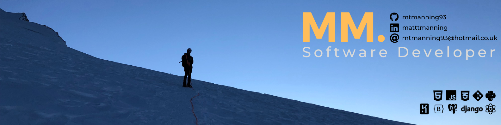

# Matt Manning
## Software Developer, Design Enthusiast, Mountain Climber.

### Who Am I?

An Englishman living in Switzerland. A software developer, graduating from Code Institute Full Stack Software Development (Advanced Front End) Programme, with interests also in design. If i am not coding im usually in the mountains.

🌐 - [View my online CV](https://mtmanning93.github.io/iam-mtmanning/)

📫 - mtmanning93@hotmail.co.uk

### Ready to Connect?

### Showcase Projects - Below you can view some of my repositories and projects. 

<!--✨

Here are some ideas to get you started:

-  I’m currently working on ...
- 🌱 I’m currently learning ...
- 👯 I’m looking to collaborate on ...
- 🤔 I’m looking for help with ...
- 💬 Ask me about ...
- 😄 Pronouns: ...
-  Fun fact: ...
-->
