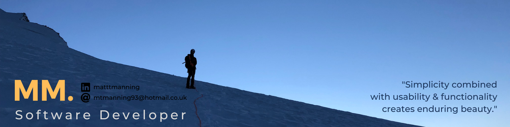

# Matt Manning
## Software Developer

### Who Am I?

Hi, I'm Matt! I'm currently a Full Stack Software Develpoment student at Code Institute. If i am not coding im usually in the mountains climbing or running. 

### Ready to Connect?

<!--
**mtmanning93/mtmanning93** is a ✨ _special_ ✨ repository because its `README.md` (this file) appears on your GitHub profile.

Here are some ideas to get you started:

- 🔭 I’m currently working on ...
- 🌱 I’m currently learning ...
- 👯 I’m looking to collaborate on ...
- 🤔 I’m looking for help with ...
- 💬 Ask me about ...
- 📫 How to reach me: ...
- 😄 Pronouns: ...
- ⚡ Fun fact: ...
-->
